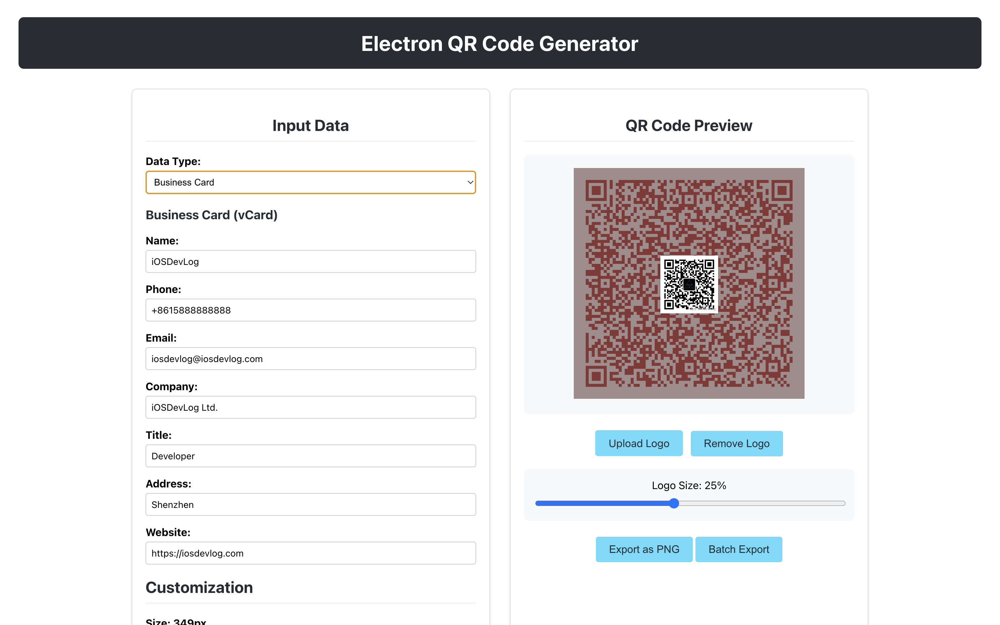

# Electron QR Code Generator

A cross-platform desktop application built with Electron that allows users to create customized QR codes for various purposes.

## Screenshots



## Features

- Generate QR codes for:
  - Basic text and URLs
  - Contact information (Phone calls, Emails)
  - Geographic locations
  - Wi-Fi network credentials
  - Business cards (vCard format)
- Customize QR code appearance:
  - Adjustable dimensions
  - Customizable foreground and background colors
  - Error correction levels (L, M, Q, H)
    - L: ~7% correction
    - M: ~15% correction
    - Q: ~25% correction
    - H: ~30% correction
  - Margin size and inclusion
- Export functionality:
  - Download as PNG images
  - Support for different export formats
  - Batch generation capabilities
  - Logo embedding in QR codes (centered, adjustable size up to 50%)
- Advanced features:
  - Preferences saving and loading
  - Real-time preview of all customizations

## 技术栈

- **框架**: Electron (Chromium + Node.js)
- **前端**: React with TypeScript
- **UI 库**: 自定义 CSS
- **二维码生成**: qrcode.react
- **构建工具**: Vite
- **状态管理**: React useState
- **打包**: Electron Builder

## 安装

```bash
# 克隆仓库
git clone https://github.com/buld-your-own-x-with-ai/Electron-QR-Code-Generator

# 安装依赖
yarn install
```

注意：如果安装 Electron 时遇到网络问题，您可以：

1. 设置 Electron 镜像：
   ```bash
   ELECTRON_MIRROR=https://npmmirror.com/mirrors/electron/ yarn install
   ```

2. 或者单独安装 Electron：
   ```bash
   yarn add electron --dev
   ```

## 开发

```bash
# 以开发模式运行应用
yarn dev
```

## 生产构建

```bash
# 构建应用
yarn build

# 打包分发版本
yarn electron:build
```

## 项目结构

```
src/
├── main/          # 主进程 (Electron)
│   ├── main.ts    # 主进程入口点
│   ├── menu.ts    # 应用菜单
│   ├── preload.ts # 预加载脚本，用于安全 IPC
│   └── ipcHandlers.ts # IPC 处理程序
├── renderer/      # 渲染进程 (React)
│   ├── App.tsx    # 主 React 组件
│   ├── main.tsx   # 渲染进程入口点
│   ├── exportUtils.ts # 导出工具
│   └── App.css    # 样式
└── shared/        # 进程间共享代码
    ├── types.ts   # TypeScript 接口
    └── qrFormatter.ts # 二维码数据格式化
```

## 架构

该应用遵循 Electron 推荐的架构，主进程和渲染进程之间有明确的分离：

- **主进程**: 处理窗口创建、菜单管理、文件系统操作和 IPC 通信
- **渲染进程**: 处理 UI、二维码生成和用户交互
- **IPC 通信**: 使用 Electron 的 contextBridge 在进程间进行安全通信

## 功能实现状态

- [x] 基本二维码生成
- [x] 多数据类型支持 (文本、联系人、位置、Wi-Fi、名片)
- [x] 二维码自定义 (尺寸、颜色)
- [x] 导出为 PNG
- [x] 批量导出
- [x] Logo 嵌入
- [x] 偏好设置保存
- [x] 高级自定义选项

## 许可证

MIT
